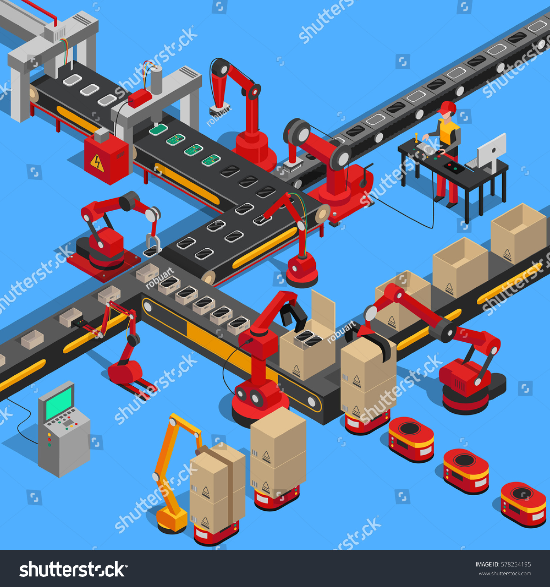
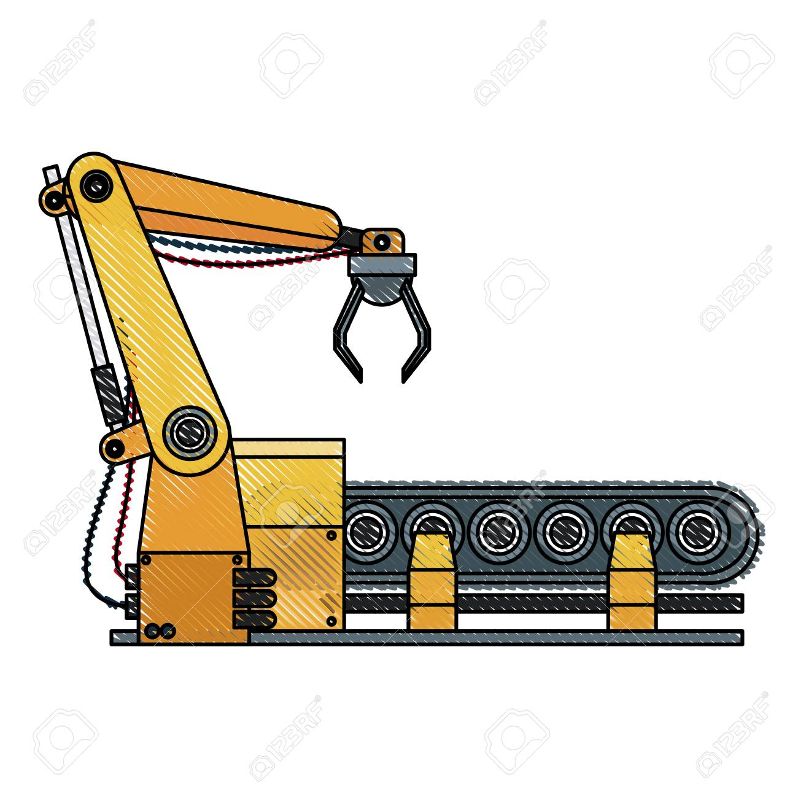
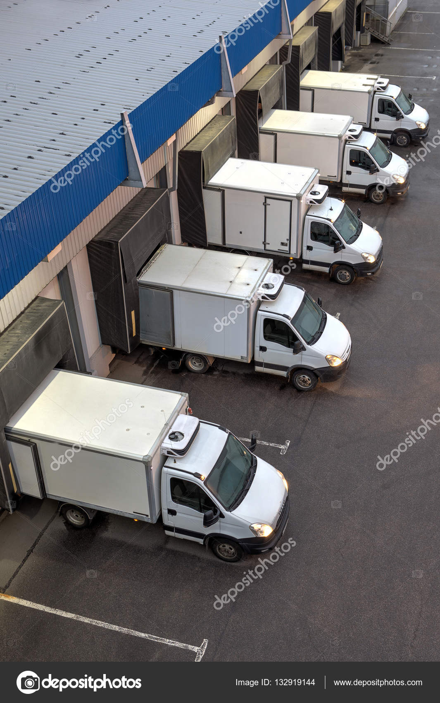

# Practical Comparison Of Application To Real World Example

Every part of the Shain application could be compared to a real life clothing factory where packages
are brought from the storage house, processed through the assembly line, stamped for the right Customer
and handed to the Carriers to be transported to the given Customer

## Application Factory

[Main Class](../../src/main/java/org/example/ShainApplication.java) is yours company's grand opening and
where your factory(application) is up and running and ready for business           

## Real life Objects

Every class inside the model package within my application
represents real world object that we use within the logic of 
our app and to create objects from.

## Storage

Every class inside the repository package represents 
its own database containing all of the objects created
using our models.

## Assembly/Operations

Every class inside the service package represents a 
part of the assembly line where we keep our business 
and operations logic.

## Moving Parts

Every single method within our application represents one
moving part of our assembly line. Every time a method is
called it executes everything inside and when it reaches
the end line it terminates and is ready to be called again.

## Carrier Dispatch

Every single class in the Api package represents a gateway
for our application to communicate with the outside world.

