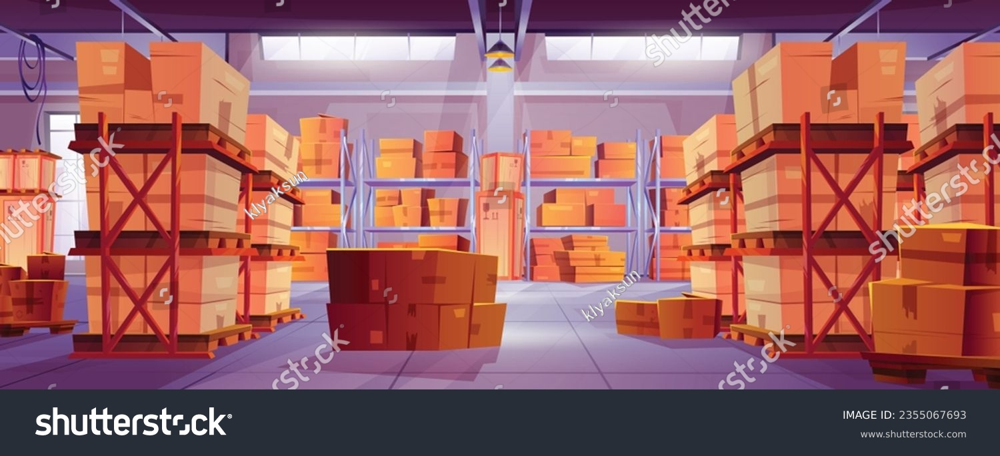

# Practical Comparison Of Application To Real World Example

Every part of the Shain application could be compared to a real life clothing factory where packages
are brought from the storage house, processed through the assembly line, stamped for the right Customer
and handed to the Carriers to be transported to the given Customer

## Application Factory

[Main Class](../../src/main/java/org/example/ShainApplication.java) is yours company's grand opening and
where your factory(application) is up and running and ready for business           

## Participants/Components

## Storage

## Assembly/Operations

## Moving Parts

## Carrier Dispatch

